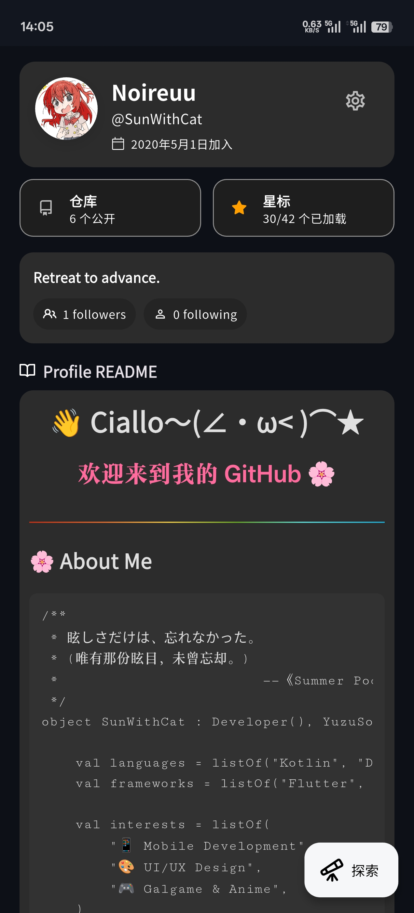
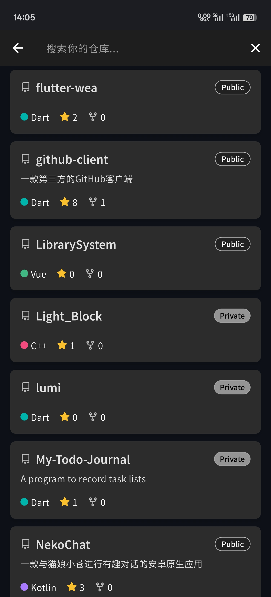
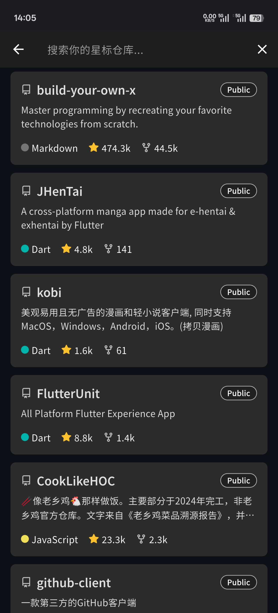
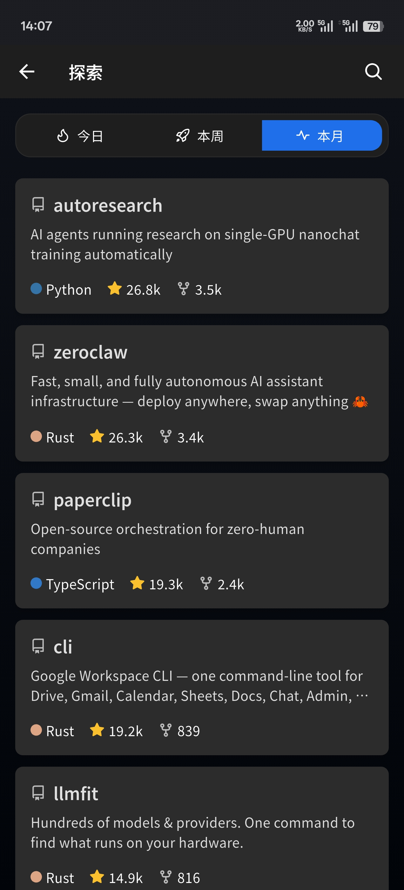
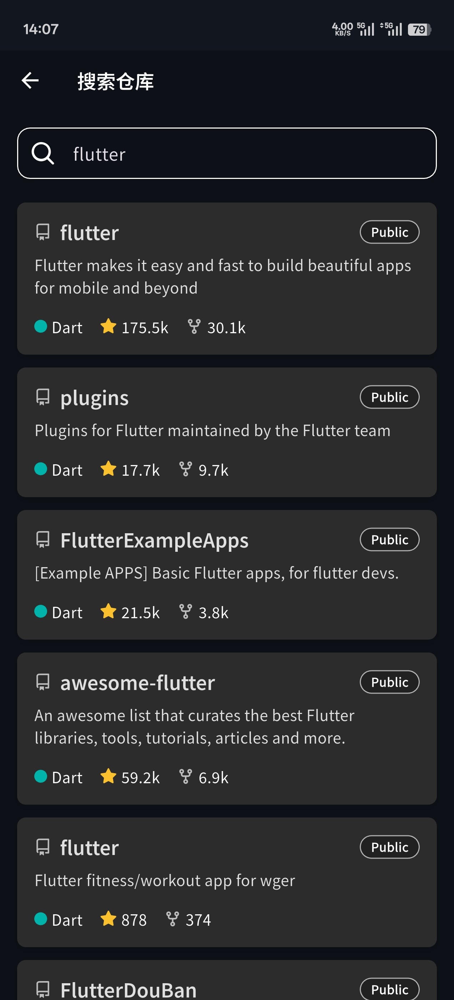

# GhClient

<p align="center">
  <strong>一款精美的 Flutter GitHub 客户端</strong>
</p>

<p align="center">
  
  
  
</p>

<p align="center">
  <a href="https://github.com/SunWithCat/github-client/stargazers">
    
  </a>
  <a href="https://github.com/SunWithCat/github-client/network/members">
    
  </a>
  <a href="https://github.com/SunWithCat/github-client/issues">
    
  </a>
  
</p>

---

## 🌙 关于这个项目

GhClient 是一款使用 Flutter 构建的第三方 GitHub 客户端，旨在提供流畅、美观且功能丰富的移动端 GitHub 体验。

## 📑 目录

- [功能特性](#-功能特性)
- [应用截图](#-应用截图)
- [技术栈](#-技术栈)
- [快速开始](#-快速开始)
- [许可证](#-许可证)

## ✨ 功能特性

- 🔐 **安全登录** - 通过 GitHub OAuth 实现安全可靠的用户认证
- 📂 **仓库阅览** - 浏览、搜索您的个人仓库和星标仓库
- 🔍 **项目探索** - 查看、搜索本月/周/日的趋势项目
- 🌓 **主题切换** - 内置浅色和深色两种主题模式
- 📄 **HTML 渲染** - 使用轻量的 HTML 渲染 README 和文档内容

## 📱 应用截图

<p align="center">
  
  
  
  
</p>
<p align="center">
  
  
</p>

## 🔧 技术栈

<p align="center">
  
  
  
  
  
</p>

| 类别 | 库 | 用途 |
|------|-----|------|
| **状态管理** | [Flutter Riverpod](https://pub.dev/packages/flutter_riverpod) | Provider的升级版，管理状态 |
| **路由管理** | [go_router](https://pub.dev/packages/go_router) | 页面跳转，省代码 |
| **网络请求** | [Dio](https://pub.dev/packages/dio) | 网络请求 |
| **本地存储** | [Hive](https://pub.dev/packages/hive) + [hive_flutter](https://pub.dev/packages/hive_flutter) + [Flutter Secure Storage](https://pub.dev/packages/flutter_secure_storage) | 存数据的，安全又方便 |
| **Deep Links** | [app_links](https://pub.dev/packages/app_links) | 处理GitHub的回调链接 |
| **Markdown** | [flutter_widget_from_html_core](https://pub.dev/packages/flutter_widget_from_html_core) | 把Markdown的内容用HTML渲染 |
| **OAuth 授权** | [url_launcher](https://pub.dev/packages/url_launcher) | 打开浏览器，让用户自己授权 |
| **动画效果** | [flutter_animate](https://pub.dev/packages/flutter_animate) | 让页面动起来，显得高级 |
| **SVG 支持** | [flutter_svg](https://pub.dev/packages/flutter_svg) | 显示SVG图片，比图片清晰 |
| **图标** | [flutter_octicons](https://pub.dev/packages/flutter_octicons) | GitHub官方图标 |
| **图片** | [cached_network_image](https://pub.dev/packages/cached_network_image) | 图片缓存，省流量 |

## 🚀 快速开始

### 环境要求

- Flutter SDK `>=3.29.0`（建议用最新版，旧版可能有惊喜）
- Dart SDK `>=3.7.2`（Flutter自带，不用担心）
- Android Studio / VS Code（看你喜欢哪个IDE）
- Android SDK / Xcode（想跑哪个平台就装哪个）

### 安装运行

```bash
# 克隆项目
git clone https://github.com/SunWithCat/github-client.git
cd github-client

# 安装依赖（这个过程可能会下载很多东西，耐心等待）
flutter pub get

# 运行应用（祈祷一切正常）
flutter run
```

### 构建发布

```bash
# Android
flutter build apk --release # 构建分包使用 flutter build apk --split-per-abi

# iOS（可以试试）
flutter build ios --release
```

**温馨提示**：如果构建失败，别慌！可以先喝杯咖啡☕或者奶茶🧋，然后Google一下错误信息，或者直接问问强大的AI，99%的问题别人都遇到过～

## ⚙️ 配置说明

在 `lib/config.dart` 中配置 GitHub OAuth 相关参数：

```dart
class AppConfig {
  // 这些是敏感信息，千万别提交到公开仓库！
  static const String githubClientId = 'Ovxxxxxxxxxxx'; // 你的Client ID
  static const String githubClientSecret = 'xxxxxxxxxxxxxxxxxxxxxxxxxxxxxxxxxxxxxxxx'; // 你的Client Secret
  static const String githubCallbackUrl = 'myfluttergithubapp://callback'; // 回调URL
}
```

使用 GitHub OAuth 功能需要：

1. 在 [GitHub Developer Settings](https://github.com/settings/developers) 创建 OAuth 应用
2. 设置回调 URL（与 `lib/config.dart` 保持一致）: `myfluttergithubapp://callback`
3. 获取 `Client ID` 和 `Client Secret`（这两个很重要，别弄丢了）
4. 在 `lib/config.dart` 中配置 `githubClientId`、`githubClientSecret`、`githubCallbackUrl`

**重要提醒**：
- 千万别把 `Client Secret` 提交到公开仓库！
- 如果不小心提交了，赶紧去GitHub重新生成一个
- 本地开发可以用 `.env` 文件管理敏感信息，生产环境建议使用安全的环境变量管理方案。

## 📄 许可证

本项目采用 [MIT License](LICENSE) 许可证。

---

<p align="center">
  如果这个项目对你有帮助，请给个 ⭐ Star 支持一下！<br>
  <sub>（不给也没关系，反正作者已经习惯了）</sub>
</p>

---