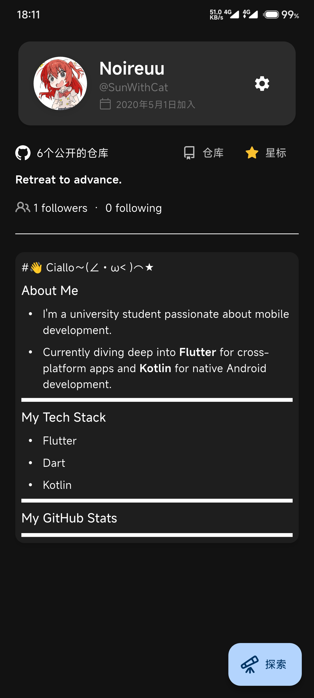
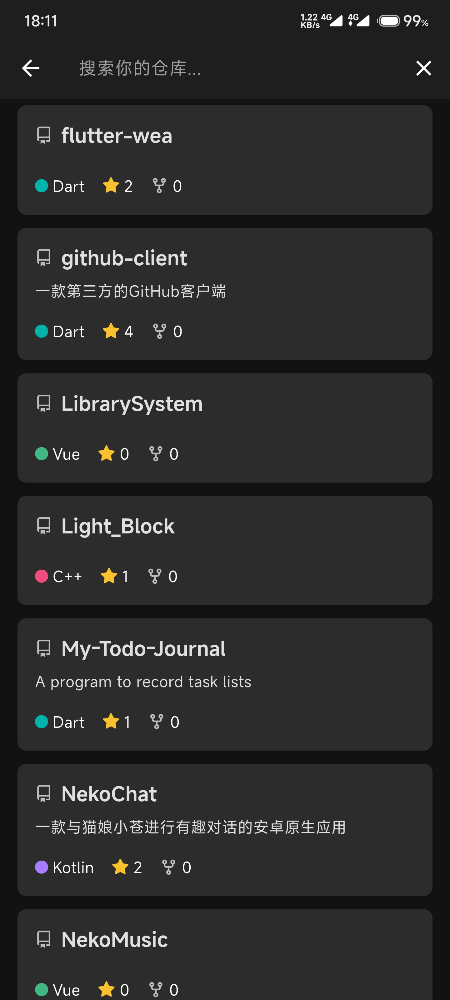
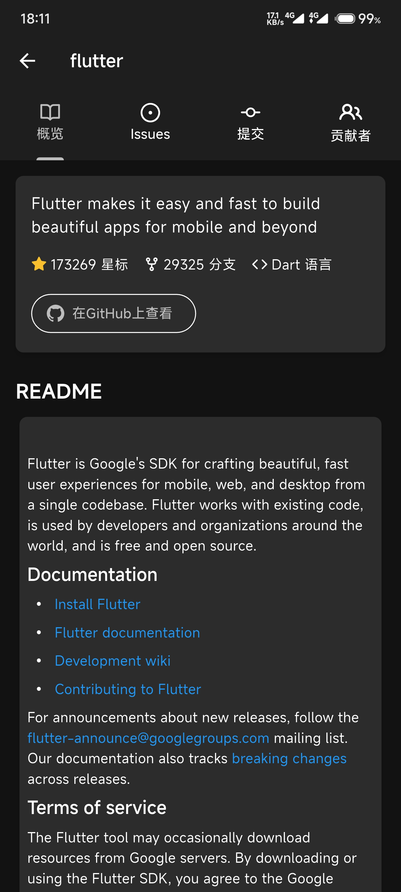

# GhClient - 一款 Flutter 开发的 GitHub 客户端

<p align="center">
  
  
  
</p>

GhClient 是一款使用 Flutter 构建的、功能丰富的第三方 GitHub 客户端应用。它旨在提供一个流畅、美观且功能全面的移动端 GitHub 体验，让您随时随地管理您的 GitHub 项目和活动。

## ✨ 主要功能

- **安全登录**: 通过 GitHub OAuth 实现安全可靠的用户认证
- **仓库管理**: 浏览、搜索和管理您的仓库
- **主题切换**: 内置浅色和深色两种主题模式

## 📱 应用截图

<div align="center" style="display: flex; gap: 20px; flex-wrap: wrap;">
  
  
  
  
  
  
</div>

## 🚀 技术栈

- **UI框架**: [Flutter](https://flutter.dev/) - Google 的 UI 工具包
- **状态管理**: [Provider](https://pub.dev/packages/provider) - 轻量级状态管理解决方案
- **网络请求**: [Dio](https://pub.dev/packages/dio) - 强大的 HTTP 客户端
- **本地存储**: [Hive](https://pub.dev/packages/hive) & [Flutter Secure Storage](https://pub.dev/packages/flutter_secure_storage) - 高性能的键值数据库和安全存储
- **OAuth 流程**: [uni_links](https://pub.dev/packages/uni_links) & [url_launcher](https://pub.dev/packages/url_launcher) - 处理深度链接和外部浏览器启动
- **Markdown 渲染**: [flutter_markdown](https://pub.dev/packages/flutter_markdown) - 渲染 GitHub 的 Markdown 内容

## 🛠️ 安装与运行

### 前提条件

- Flutter SDK
- Dart SDK (随 Flutter 一起安装)
- Android Studio / VS Code
- Android SDK / Xcode (取决于目标平台)


### 运行应用

```bash
# 调试模式运行
flutter run

# 或构建发布版本
flutter build apk  # Android
flutter build ios  # iOS
```

## 🔧 配置

要使用 GitHub OAuth 功能，您需要：

1. 在 [GitHub Developer Settings](https://github.com/settings/developers) 创建一个 OAuth 应用
2. 设置回调 URL (例如: `com.yourdomain.ghclient://oauth-callback`)
3. 获取 Client ID 和 Client Secret
4. 在项目中配置相应的值


## 📊 项目状态

该项目目前处于积极开发阶段。欢迎 Star ⭐ 关注项目进展！


