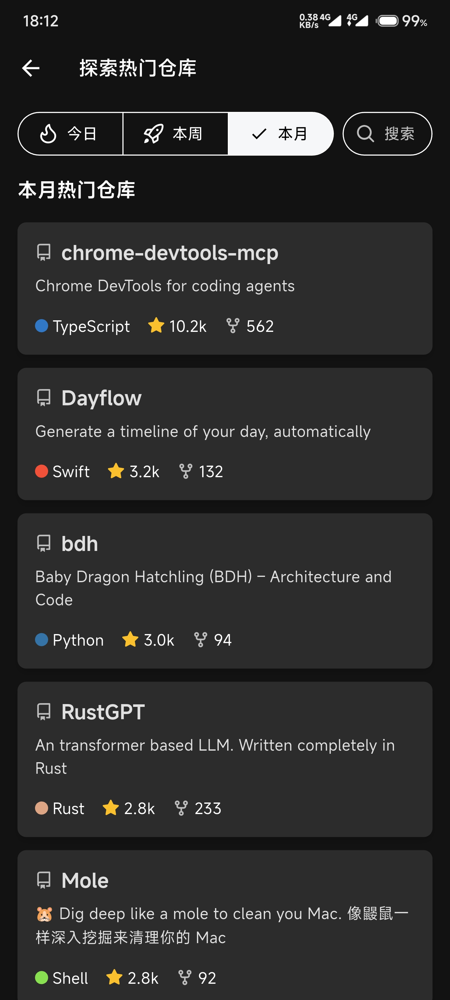
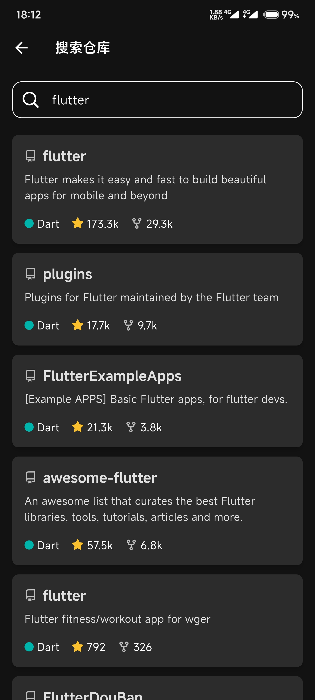

# GhClient

<p align="center">
  <strong>一款精美的 Flutter GitHub 客户端</strong>
</p>

<p align="center">
  
  
  
</p>


<p align="center">
  <a href="https://github.com/SunWithCat/github-client/stargazers">
    
  </a>
  <a href="https://github.com/SunWithCat/github-client/network/members">
    
  </a>
  <a href="https://github.com/SunWithCat/github-client/issues">
    
  </a>
  
</p>

---

GhClient 是一款使用 Flutter 构建的精美第三方 GitHub 客户端。旨在提供流畅、美观且功能全面的移动端 GitHub 体验。

## 📑 目录

- [功能特性](#-功能特性)
- [应用截图](#-应用截图)
- [技术栈](#-技术栈)
- [快速开始](#-快速开始)
- [配置说明](#-配置说明)
- [开发路线](#-开发路线)
- [贡献指南](#-贡献指南)
- [许可证](#-许可证)

## ✨ 功能特性

- 🔐 **安全登录** - 通过 GitHub OAuth 实现安全可靠的用户认证
- 📂 **仓库管理** - 浏览、搜索和管理您的仓库
- ⭐ **Star 管理** - 查看和管理您的 Star 仓库
- 🔍 **仓库搜索** - 快速搜索 GitHub 仓库
- 🌓 **主题切换** - 内置浅色和深色两种主题模式
- 📄 **Markdown 渲染** - 完美渲染 README 和文档内容

## 📱 应用截图

<p align="center">
  
  
  
  
</p>
<p align="center">
  
  
</p>

## 🛠️ 技术栈

<p align="center">
  
  
  
  
</p>

| 类别 | 库 | 用途 |
|------|-----|------|
| **状态管理** | [Flutter Riverpod](https://pub.dev/packages/flutter_riverpod) | 声明式响应式状态管理 |
| **网络请求** | [Dio](https://pub.dev/packages/dio) | HTTP 客户端 |
| **本地存储** | [Hive](https://pub.dev/packages/hive) + [Flutter Secure Storage](https://pub.dev/packages/flutter_secure_storage) | 数据持久化 & 安全存储 |
| **Deep Links** | [app_links](https://pub.dev/packages/app_links) | OAuth 回调处理 |
| **Markdown** | [flutter_markdown](https://pub.dev/packages/flutter_markdown) | README 渲染 |
| **图标** | [flutter_octicons](https://pub.dev/packages/flutter_octicons) | GitHub 图标库 |
| **图片** | [cached_network_image](https://pub.dev/packages/cached_network_image) | 网络图片缓存 |

## 🚀 快速开始

### 环境要求

- Flutter SDK `>=3.7.2`
- Dart SDK `>=3.7.2`
- Android Studio / VS Code
- Android SDK / Xcode

### 安装运行

```bash
# 克隆项目
git clone https://github.com/SunWithCat/github-client.git
cd ghclient

# 安装依赖
flutter pub get

# 运行应用
flutter run
```

### 构建发布

```bash
# Android
flutter build apk --release

# iOS
flutter build ios --release
```

## ⚙️ 配置说明

要使用 GitHub OAuth 功能：

1. 在 [GitHub Developer Settings](https://github.com/settings/developers) 创建 OAuth 应用
2. 设置回调 URL: `com.yourdomain.ghclient://oauth-callback`
3. 获取 `Client ID` 和 `Client Secret`
4. 在项目中配置相应的值

## 🗺️ 开发路线

- [x] GitHub OAuth 登录
- [x] 仓库浏览与搜索
- [x] Star 仓库管理
- [x] README 渲染
- [x] 浅色/深色主题
- [ ] Issues 管理
- [ ] Pull Requests 查看
- [ ] 通知中心
- [ ] 用户 Profile 页面
- [ ] 仓库文件浏览器

## 🤝 贡献指南

欢迎贡献代码！请遵循以下步骤：

1. Fork 本仓库
2. 创建特性分支 (`git checkout -b feature/AmazingFeature`)
3. 提交更改 (`git commit -m 'Add some AmazingFeature'`)
4. 推送到分支 (`git push origin feature/AmazingFeature`)
5. 提交 Pull Request

## 📄 许可证

本项目采用 [MIT License](LICENSE) 许可证。

---

<p align="center">
  如果这个项目对你有帮助，请给个 ⭐ Star 支持一下！
</p>
